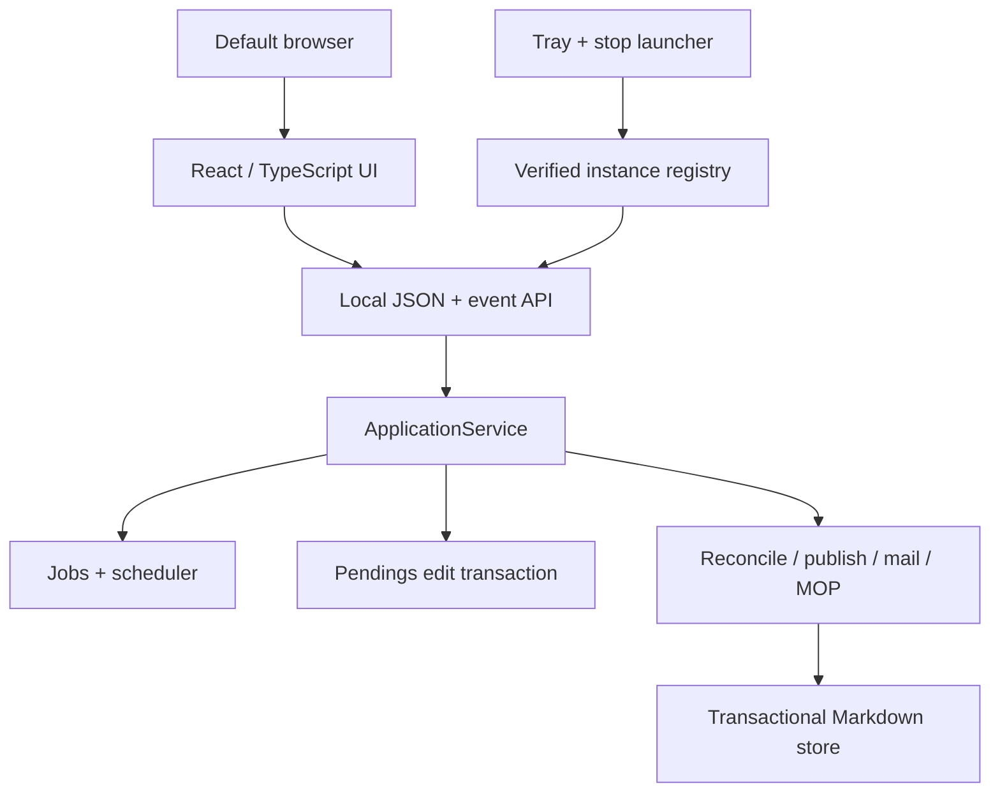

# Zeus 3 architecture

## Components

The browser is replaceable presentation. `ApplicationService` is the use-case
boundary; HTTP handlers do not implement reconciliation rules. The existing
core modules remain responsible for workbook validation, transactions,
publication, mail, and MOP generation.

## Module map

| Module | Responsibility |
|---|---|
| `zeus2/main.py` | default web command, singleton launch, browser/tray lifecycle, legacy command delegation |
| `zeus2/application/service.py` | use cases, scheduler, operation serialization, data events |
| `zeus2/application/jobs.py` | one mutation lane, progress snapshots, cancellation, SSE events |
| `zeus2/application/edits.py` | conflict-safe Pendings-first browser edits |
| `zeus2/application/serialization.py` | stable dashboard/detail API shapes and sorting |
| `zeus2/application/settings.py` | typed configuration payload and validation |
| `zeus2/web/server.py` | loopback HTTP/static/API boundary and security headers |
| `zeus2/web/runtime.py` | owned-instance registration and verified shutdown |
| `zeus2/web/tray.py` | native Windows notification-area commands |
| `zeus2/web/dialogs.py` | native Browse/Open dialogs |
| `frontend/src/` | React presentation, local preferences, accessible interaction |
| `zeus2/web/static/` | committed production bundle used at runtime |

## Read and query paths

A dashboard GET reads only committed Markdown and state. A browser load never
calls startup or source reconciliation. Source reads enter through a startup,
scheduled query, or manual job. The job manager serializes these with publish,
restore, email, MOP, and browser-edit mutations.

Server-Sent Events are short local long-polls containing job/configuration/data
events. The UI updates visible activity immediately and rereads committed data
only after a dataset event.

## Lifecycle and shutdown

Launch is guarded by an atomic local lock. If a healthy registered instance
exists, a second launch opens its URL. Otherwise Zeus selects the preferred
loopback port, registers its instance, starts the service, then opens the
browser.

Each registry record contains a random instance ID, exact local URL, process
ID, operating-system process-birth marker, private shutdown token, install root,
and start time. Stop first requests graceful shutdown. Forced termination is
allowed only while both PID and birth marker still match the record.

## Packaging

Vite builds hashed JavaScript/CSS into `zeus2/web/static`. Setuptools package
discovery includes all Python subpackages and package data includes the static
bundle. PyInstaller collects the same directory. Runtime launchers call the
Python module directly; they do not install or execute frontend tooling.

## Verification layers

- core regression tests preserve the 2.0.3 data and recovery contracts;
- application tests cover Pendings-only bootstrap, web edits, conflicts,
  serialized jobs, local HTTP security, no-query GETs, and safe stale records;
- Vitest covers field preference persistence, wheel event ownership, ticket
  interaction, safe email rendering, and minimal edit payloads;
- Playwright drives Chrome and Microsoft Edge against a real Python server to
  verify list scrolling, no page scrolling, ticket panels, persisted fields,
  and visible manual queries;
- Windows CI runs Python 3.13 and 3.14, rebuilds the UI, and checks wheel/static
  package behavior before a branch is merged.
