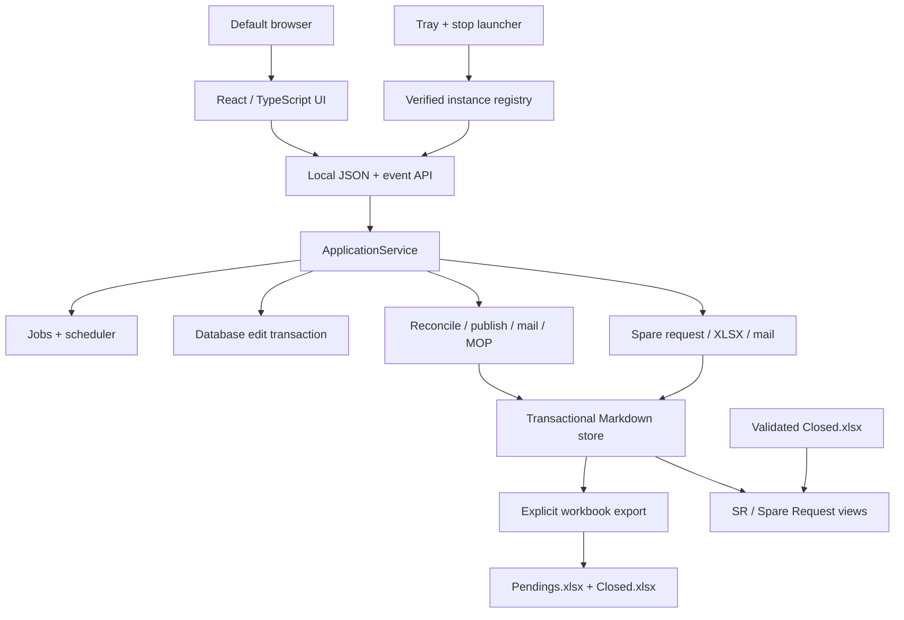

# Zeus 3 architecture

## Components

The browser is replaceable presentation. `ApplicationService` is the use-case
boundary; HTTP handlers do not implement reconciliation rules. The existing
core modules remain responsible for workbook validation, transactions,
publication, mail, and MOP generation.

## Module map

| Module | Responsibility |
|---|---|
| `zeus2/main.py` | default web command, singleton launch, browser/tray lifecycle, legacy command delegation |
| `zeus2/application/service.py` | use cases, scheduler, operation serialization, data events |
| `zeus2/application/jobs.py` | one mutation lane, progress snapshots, cancellation, SSE events |
| `zeus2/application/edits.py` | revision-safe, validated database-first browser edits |
| `zeus2/maintenance_windows.py` | unified MW state, legacy projections, attempt history, and outcome transitions |
| `zeus2/database_maintenance.py` | preview, backup-backed schema migration, Markdown repair, and atomic validation |
| `zeus2/excel_export.py` | explicit verified Pendings/Closed generation and legacy recovery |
| `zeus2/application/serialization.py` | stable dashboard/detail API shapes and sorting |
| `zeus2/application/settings.py` | typed configuration payload and validation |
| `zeus2/reference_data.py` | mandatory profile, global structured managers, legacy-manager migration, and BOM catalog |
| `zeus2/storage_migration.py` | capacity checks, verified clone/restart handoff, rollback, and original cleanup |
| `zeus2/spare_requests.py` | independent request schema, validation, status, identity, and fault-evidence grouping |
| `zeus2/spare_request_excel.py` | template-preserving request/return exports and Closed archive tabs |
| `zeus2/spare_request_mail.py` | configured confirmation, dispatch, and warehouse parsing, replay, association, conflicts, and retention |
| `zeus2/web/server.py` | loopback HTTP/static/API boundary and security headers |
| `zeus2/web/runtime.py` | owned-instance registration and verified shutdown |
| `zeus2/web/tray.py` | native Windows notification-area commands |
| `zeus2/web/dialogs.py` | native Browse/Open dialogs |
| `frontend/src/` | React presentation, local preferences, accessible interaction |
| `zeus2/web/static/` | committed production bundle used at runtime |

## Read and query paths

A dashboard GET reads only committed Markdown and state. A browser load never
calls startup or source reconciliation. Advanced Search reads enter through a
startup, scheduled check, or manual job; these reads discover/refresh tickets
and mark missing IDs for deferred closure. They never import Pendings. The job
manager serializes them with explicit export, legacy recovery, email, MOP, and
browser-edit mutations.

The dashboard endpoint accepts a validated workspace key. Each workspace owns
its schema and sort vocabulary. Service Request rows resolve to ticket detail;
active Spare Request rows resolve to their independent request detail; eligible
rows intentionally resolve through the originating ticket before export. This
boundary allows future workspaces without conflating their persistence models.

Server-Sent Events are short local long-polls containing job/configuration/data
events. The UI updates visible activity immediately and rereads committed data
only after a dataset event.

Before profile completion, the server exposes only static assets, health,
bootstrap, profile, and lifecycle controls. Other API routes fail with an
explicit setup-required response. Saving the first valid profile starts the
normal startup job and scheduler without requiring an application relaunch.

## Lifecycle and shutdown

Launch is guarded by an atomic local lock. If a healthy registered instance
exists, a second launch opens its URL. Otherwise Zeus selects the preferred
loopback port, registers its instance, starts the service, then opens the
browser.

Each registry record contains a random instance ID, exact local URL, process
ID, operating-system process-birth marker, private shutdown token, install root,
and start time. Stop first requests graceful shutdown. Forced termination is
allowed only while both PID and birth marker still match the record.

A storage move leaves configuration and the instance registry in the fixed
application home. The mutable data tree is cloned to an empty chosen folder,
verified, and selected in configuration before the existing process requests a
soft restart. The new process rechecks both manifests, then deletes the old
tree. Any pre-handoff mismatch selects the original and removes the rejected
clone; interrupted old-tree cleanup is retried as a forward-only operation.

## Packaging

Vite builds hashed JavaScript/CSS into `zeus2/web/static`. Setuptools package
discovery includes all Python subpackages and package data includes the static
bundle. PyInstaller collects the same directory. Runtime launchers call the
Python module directly; they do not install or execute frontend tooling.

## Verification layers

- core regression tests preserve the 2.0.3 data and recovery contracts;
- Spare Request tests cover quantity-only unit/Fault Tag expansion, combined
  multi-serial evidence cells, immutable identities, partial/out-of-order mail,
  template sheet preservation, return output, archive gating, and retention;
- profile/reference/storage tests cover setup validation, relationship
  integrity, capacity rejection, clone verification, rollback, and cleanup retry;
- application tests cover database-first startup and saves, explicit paired
  export/finalization, legacy recovery journals, serialized jobs, local HTTP
  security, no-query GETs, and safe stale records;
- Vitest covers field/filter preference persistence, OR/AND filter semantics,
  wheel ownership, protected draft restoration, bounded tab navigation,
  command suppression, safe email rendering, and minimal edit payloads;
- Playwright drives Chrome and Microsoft Edge against a real Python server to
  verify list scrolling, no page scrolling, ticket panels, persisted fields and
  sort direction, global commands, and visible manual queries;
- Windows CI runs Python 3.13 and 3.14, rebuilds the UI, and checks wheel/static
  package behavior before a branch is merged.
